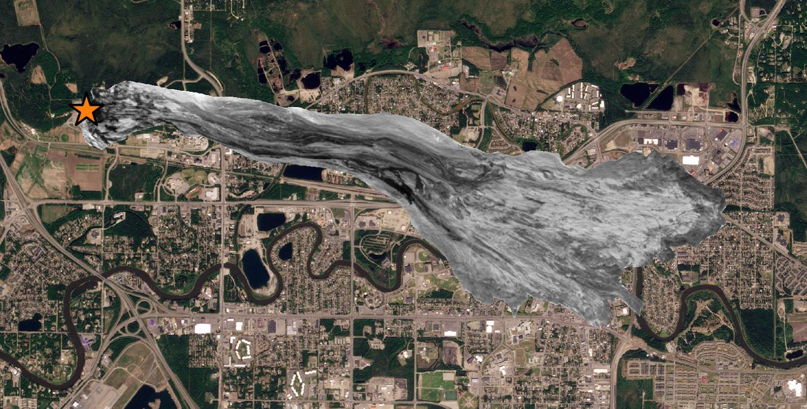

# *landslide_superimpose*

*landslide_superimpose* is a landslide size visualization outreach tool.

Given the following inputs:
* A satellite image of a landslide deposit
* An outline of the landslide deposit (e.g., from GIS software)
* The coordinates of the crown of the landslide
* A "background" satellite image of any other location
* The coordinates of a target point in the "background" satellite image

[`landslide_superimpose.py`](landslide_superimpose.py) will:
* Convert all geospatial objects into their equivalent UTM coordinate reference
  systems
* Clip the landslide image using the landslide outline
* Superimpose the clipped landslide image on the background image, placing the
  landslide crown at the target location

The operations are performed such that the landslide deposit has the same scale
as the background image. **This can create powerful visualizations of the size
of events:**



All images (rasters) are expected to be in GeoTIFF format. Landslide outlines
can be KML files or shapefiles. The code *should* [keyword! 😉] be able to
handle arbitrary coordinate reference systems for these inputs. All coordinates
are expected to be (latitude, longitude) in the WGS 84 datum.

## Quickstart

1. Obtain
   ```
   git clone https://github.com/liamtoney/landslide_superimpose.git
   cd landslide_superimpose
   ```

2. Create environment, install, and activate
   ([install conda](https://conda.io/projects/conda/en/latest/user-guide/install/index.html)
   first, if necessary)
   ```
   conda env create
   conda activate landslide_superimpose
   ```

3. Run as a Python script within IPython
   ```
   ipython
   In [1]: run landslide_superimpose.py
   ```

## Disclaimer

This code has not been extensively tested, nor should you expect it to work
without modifying the paths in the top of the script and providing your own
input files!
